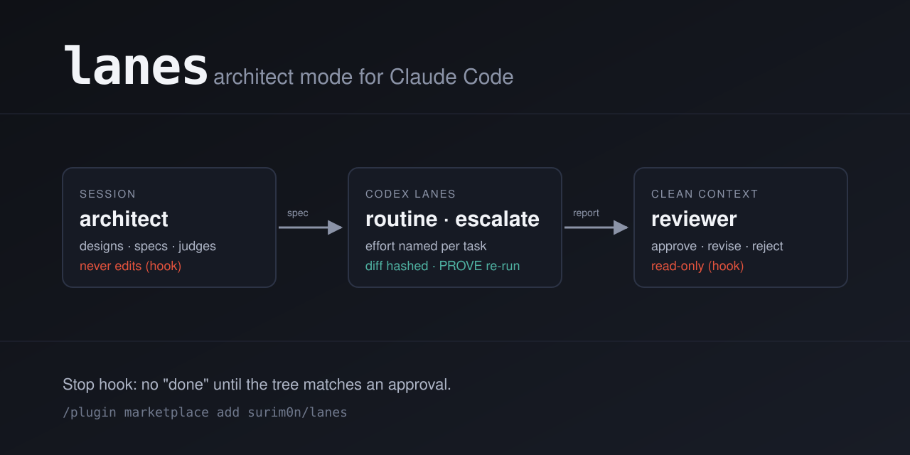

# lanes



**Fable thinks. Codex types. A second Fable checks. Claude Code makes sure it stays that way.**

Run your Claude Code session on Fable. Fable never writes code. It writes a short spec and hands it to Codex (GPT-5.6 Luna), which does the implementation. When Codex is done, the proof command from the spec is re-run for real. Then a fresh Fable reviewer, with no memory of the conversation, reads the diff and says approve, revise or reject. Until it says approve, the session can't call the job done.

That's the whole idea. Hooks and one script make it hold; the prompts just explain it.

Why split it this way: Fable's tokens go to thinking instead of typing, Codex is cheaper and from a different vendor, and the review comes from a context that didn't write the spec.

```
you ──► Fable (orchestrates) ──► lanes run ──► Codex (implements)
               │                                    │
               │                     report: diff · proof re-run · exit code
               ▼
        Fable reviewer (fresh context, read-only) ──► approve | revise | reject
               │
        Stop hook: no "done" until the tree matches an approval
```

## Install

```
/plugin marketplace add surim0n/lanes
/plugin install lanes@lanes
```

Needs `git` and the [Codex CLI](https://github.com/openai/codex) logged in (`npm i -g @openai/codex && codex login`). Then `/lanes:doctor`.

## Use

```
/model fable
/lanes:architect on
Add rate limiting to the public API.
```

Fable writes the spec, runs a lane, reads the report, and calls the reviewer before it can report done. `/lanes:status` shows mode, gate and models. `/lanes:architect off` when you want to edit by hand again.

## What is enforced, what has a known hole, what is only asked

| Rule | How |
|---|---|
| Fable never edits files | PreToolUse hook denies Edit, Write, MultiEdit, NotebookEdit |
| Every spec has a task, files and a proof command | `lanes run` refuses it otherwise (exit 5) |
| An effort is named per task and never rounded | `--effort` is required; a rung the model lacks is refused |
| "It worked" is not evidence | `lanes run` re-runs PROVE itself and shows the output (exit 1 on failure) |
| An empty diff is not a success | tree hash before vs after (exit 2) |
| Parallel lanes can't clobber each other | `--worktree` runs the lane on a copy and returns a patch |
| The reviewer can't change anything | PreToolUse hook limits its shell to git reads, `lanes reports`, `lanes status` |
| The reviewer sees the evidence | `lanes reports` holds every report since the last approval |
| Only the reviewer clears the gate | its `VERDICT:` line is read from its own transcript by a SubagentStop hook; `lanes approve` is denied to Claude and reserved for your terminal |
| Nothing is done until approved | Stop hook blocks the turn while the tree differs from the approved hash |

Known holes, stated plainly:

- The Stop gate yields on the immediate retry, so a session that needs to ask you something can. It fires again next turn.
- Fable could prompt its own reviewer to rubber-stamp. The reviewer is told not to; that is a prompt, not a mechanism.
- Hooks don't police shell redirects. `cat > file` in Bash is only forbidden by the skill.

This is a guardrail against a lazy or hurried session, not a security boundary against an adversarial one.

## The lanes

| Lane | Default model | Efforts | Use |
|---|---|---|---|
| routine | gpt-5.6-luna | low … max | Everything, unless below |
| escalate | gpt-5.6-sol | low … ultra | The rare task the spec can't pin down, or a routine miss twice on a corrected spec |

Both run `codex exec` in a `workspace-write` sandbox with no network (`--network` for package installs). Model names live only in `lanes.conf`; override per project in `.claude/lanes.conf` or per run with `--model`. `lanes doctor` checks the slugs and effort rungs against Codex's own model list.

## The spec

```
TASK:
What to build and what finished looks like.

FILES:
src/limiter.ts        (create)
src/index.ts          (modify)

CONTRACT:
export function limit(key: string, rps: number): Promise<boolean>

RULES:
No new dependencies. Don't touch the auth middleware.

PROVE:
npm test -- limiter
```

`lanes spec-template` prints a blank one. Headers can also be markdown (`## Task`).

## The script

```
lanes run <routine|escalate> --effort <rung> [--model m] [--timeout s] [--worktree] [--network] [--dry-run] [SPEC|-]
lanes doctor          codex install and login, models vs Codex's list, timeout backend, repo state
lanes status          architect mode, gate, reports pending, resolved lanes
lanes mode on|off     architect mode
lanes reports         every lane report since the last approval
lanes approve         human override from your terminal (Claude is denied it)
lanes spec-template   blank spec
```

Exit codes for `run`: 0 done, 1 PROVE failed, 2 nothing changed, 3 timeout, 4 codex unavailable, 5 usage or spec error, 6 codex error. Every run leaves `spec.md`, `prompt.md`, `codex.log`, `final.md`, `prove.log`, `changes.patch` and `report.txt` under `$TMPDIR/lanes/<timestamp>-<lane>/`.

The plugin's `bin/` is on the session's PATH. State lives in `.git/lanes/` of the checkout: nothing to commit, nothing to gitignore.

## If something is missing

- No Fable on the account: change `model: fable` to `opus` in `agents/reviewer.md` and run the session on Opus.
- No Codex: lanes exit 4. Turn architect mode off and keep the reviewer.
- No `timeout` binary: `lanes` falls back to `gtimeout`, then `perl`, then warns and runs uncapped.
- No `jq`: hooks parse with `sed`; `lanes doctor` skips the model cross-check.

## Development

`tests/run.sh` (fake Codex, bash 3.2 and 5), `tests/lint-frontmatter.sh`, `claude plugin validate .`, `assets/render.sh` for the banner. CI runs all of it on macOS and Linux with shellcheck and a link check.

## License

MIT
